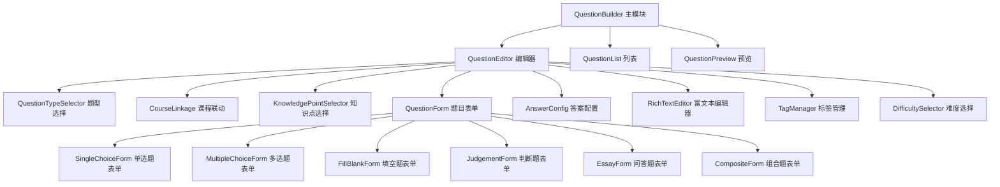

# 设计文档：试题组卷系统

## 概述

试题组卷系统是一个基于 Vue 3 + Ant Design Vue 的单页应用模块，采用组件化架构设计。系统通过 Pinia 进行状态管理，使用 Composition API 构建可复用的业务逻辑，通过 RESTful API 与后端服务交互。

核心设计理念：
- 组件化：将复杂的题目编辑功能拆分为独立、可复用的组件
- 类型安全：使用 TypeScript 确保类型安全
- 响应式：利用 Vue 3 的响应式系统实现高效的数据绑定
- 可扩展：支持轻松添加新的题型和功能
- UI 一致性：全面使用 Ant Design Vue 组件库，确保界面风格统一

**Ant Design Vue 使用原则**：
- 优先使用 Ant Design Vue 提供的组件（表单、按钮、选择器、标签等）
- 保持与现有项目的视觉风格一致
- 遵循 Ant Design 的设计规范和最佳实践
- 只在 Ant Design Vue 没有提供合适组件时才自定义实现

## 架构

### 整体架构

系统采用三层架构：

```
┌─────────────────────────────────────────┐
│         Presentation Layer              │
│  (Vue Components + Ant Design Vue)      │
├─────────────────────────────────────────┤
│         Business Logic Layer            │
│     (Pinia Stores + Composables)        │
├─────────────────────────────────────────┤
│         Data Access Layer               │
│          (API Services)                 │
└─────────────────────────────────────────┘
```

### 模块划分



## 组件与接口

### 1. QuestionBuilder（主容器组件）

**职责**：作为试题组卷系统的入口组件，管理整体布局和路由。

**使用的 Ant Design Vue 组件**：
- `a-layout`：整体布局容器
- `a-layout-sider`：左侧导航栏
- `a-layout-content`：主内容区域
- `a-menu`：导航菜单

**接口**：
```typescript
interface QuestionBuilderProps {
  mode?: 'create' | 'edit' | 'view'
  questionId?: string
}

interface QuestionBuilderEmits {
  (e: 'save', question: Question): void
  (e: 'cancel'): void
}
```

**子组件**：
- QuestionEditor
- QuestionList
- QuestionPreview

### 2. QuestionEditor（题目编辑器）

**职责**：协调各个子组件，管理题目编辑流程。

**使用的 Ant Design Vue 组件**：
- `a-form`：表单容器
- `a-form-item`：表单项
- `a-card`：卡片容器
- `a-button`：操作按钮
- `a-space`：间距布局
- `a-divider`：分割线

**接口**：
```typescript
interface QuestionEditorProps {
  questionId?: string
  initialData?: Partial<Question>
}

interface QuestionEditorEmits {
  (e: 'save', question: Question): void
  (e: 'cancel'): void
  (e: 'validate', isValid: boolean): void
}
```

**状态管理**：
- 当前编辑的题目数据
- 表单验证状态
- 保存状态（loading/success/error）

### 3. QuestionTypeSelector（题型选择器）

**职责**：提供题型选择功能，支持题型切换。

**使用的 Ant Design Vue 组件**：
- `a-radio-group`：题型单选组
- `a-radio-button`：题型选项按钮

**接口**：
```typescript
interface QuestionTypeSelectorProps {
  modelValue: QuestionType
  disabled?: boolean
}

interface QuestionTypeSelectorEmits {
  (e: 'update:modelValue', type: QuestionType): void
  (e: 'change', type: QuestionType): void
}

type QuestionType = 'single' | 'multiple' | 'fillBlank' | 'judgement' | 'essay' | 'composite'
```

### 4. CourseLinkage（课程联动选择器）

**职责**：实现课程、年级、学期、单元的级联选择。

**使用的 Ant Design Vue 组件**：
- `a-select`：下拉选择器（用于课程、年级、学期、单元）
- `a-space`：间距布局
- `a-spin`：加载状态指示器

**接口**：
```typescript
interface CourseLinkageProps {
  modelValue: CourseLinkageValue
}

interface CourseLinkageValue {
  courseId?: string
  gradeId?: string
  semesterId?: string
  unitId?: string
}

interface CourseLinkageEmits {
  (e: 'update:modelValue', value: CourseLinkageValue): void
}
```

**数据流**：
1. 加载课程列表
2. 根据选中的课程加载年级列表
3. 根据选中的年级加载学期列表
4. 根据选中的学期加载单元列表

### 5. KnowledgePointSelector（知识点选择器）

**职责**：提供树形结构的知识点选择功能。

**使用的 Ant Design Vue 组件**：
- `a-modal`：弹窗容器
- `a-tree`：树形控件
- `a-input-search`：搜索输入框
- `a-select`：教材筛选下拉框
- `a-button`：确认/取消按钮

**接口**：
```typescript
interface KnowledgePointSelectorProps {
  modelValue: string[]
  textbookFilter?: string
  multiple?: boolean
}

interface KnowledgePointSelectorEmits {
  (e: 'update:modelValue', ids: string[]): void
}

interface KnowledgePoint {
  id: string
  name: string
  parentId?: string
  children?: KnowledgePoint[]
}
```

**功能**：
- 树形结构展示
- 支持展开/收起
- 支持搜索过滤
- 支持教材筛选

### 6. QuestionForm（题目表单基类）

**职责**：定义所有题型表单的通用接口和行为。

**接口**：
```typescript
interface QuestionFormProps {
  modelValue: QuestionData
  readonly?: boolean
}

interface QuestionFormEmits {
  (e: 'update:modelValue', data: QuestionData): void
  (e: 'validate', result: ValidationResult): void
}

interface QuestionData {
  type: QuestionType
  stem: string
  answer: AnswerData
  analysis?: string
  scoringCriteria?: string
}

interface ValidationResult {
  valid: boolean
  errors: ValidationError[]
}

interface ValidationError {
  field: string
  message: string
}
```

### 7. SingleChoiceForm（单选题表单）

**职责**：处理单选题的特定编辑逻辑。

**使用的 Ant Design Vue 组件**：
- `a-form-item`：表单项
- `a-input`：选项内容输入
- `a-radio-group`：答案选择
- `a-radio`：单个答案选项
- `a-button`：添加选项按钮
- `a-space`：选项布局

**接口**：
```typescript
interface SingleChoiceData extends QuestionData {
  type: 'single'
  options: Option[]
  answer: {
    correctOption: string // 'A' | 'B' | 'C' | 'D' | ...
  }
}

interface Option {
  label: string // 'A', 'B', 'C', 'D', ...
  content: string
}
```

**功能**：
- 默认提供 A、B、C、D 四个选项
- 支持动态添加选项
- 单选答案选择
- 选项内容富文本编辑

### 8. MultipleChoiceForm（多选题表单）

**职责**：处理多选题的特定编辑逻辑。

**使用的 Ant Design Vue 组件**：
- `a-form-item`：表单项
- `a-input`：选项内容输入
- `a-checkbox-group`：答案选择
- `a-checkbox`：单个答案选项
- `a-button`：添加选项按钮
- `a-space`：选项布局

**接口**：
```typescript
interface MultipleChoiceData extends QuestionData {
  type: 'multiple'
  options: Option[]
  answer: {
    correctOptions: string[] // ['A', 'B', ...]
  }
}
```

**验证规则**：
- 至少选择两个正确答案

### 9. FillBlankForm（填空题表单）

**职责**：处理填空题的特定编辑逻辑。

**使用的 Ant Design Vue 组件**：
- `a-form-item`：表单项
- `a-input`：答案输入框
- `a-button`：添加填空按钮
- `a-space`：布局
- `a-checkbox`：允许答案顺序不一致选项
- `a-tag`：答案标签（用于多个可接受答案）
- `a-input-group`：答案输入组

**接口**：
```typescript
interface FillBlankData extends QuestionData {
  type: 'fillBlank'
  answer: {
    blanks: BlankAnswer[]
    allowUnorderedAnswer?: boolean
  }
}

interface BlankAnswer {
  index: number
  acceptedAnswers: string[]
  description?: string
}
```

**功能**：
- 在题干中标记填空位置
- 为每个空配置多个可接受答案
- 支持答案顺序不一致选项
- 动态添加/删除填空

### 10. JudgementForm（判断题表单）

**职责**：处理判断题的特定编辑逻辑。

**使用的 Ant Design Vue 组件**：
- `a-form-item`：表单项
- `a-radio-group`：答案选择
- `a-radio`：正确/错误选项

**接口**：
```typescript
interface JudgementData extends QuestionData {
  type: 'judgement'
  answer: {
    correct: boolean
  }
}
```

### 11. EssayForm（问答题表单）

**职责**：处理问答题的特定编辑逻辑。

**使用的 Ant Design Vue 组件**：
- `a-form-item`：表单项
- `a-textarea`：参考答案输入（或使用富文本编辑器）

**接口**：
```typescript
interface EssayData extends QuestionData {
  type: 'essay'
  answer: {
    referenceAnswer: string // 必填
  }
}
```

**验证规则**：
- 参考答案为必填项

### 12. CompositeForm（组合题表单）

**职责**：处理组合题的特定编辑逻辑。

**使用的 Ant Design Vue 组件**：
- `a-form-item`：表单项
- `a-card`：子题卡片容器
- `a-button`：添加/删除子题按钮
- `a-select`：子题题型选择
- `a-space`：布局
- `a-divider`：分割线

**接口**：
```typescript
interface CompositeData extends QuestionData {
  type: 'composite'
  mainStem: string
  subQuestions: SubQuestion[]
}

interface SubQuestion {
  id: string
  order: number
  type: QuestionType
  data: QuestionData
}
```

**功能**：
- 主题干编辑
- 添加/删除子题
- 为每个子题选择题型
- 子题自动编号

### 13. RichTextEditor（富文本编辑器）

**职责**：提供富文本编辑功能。

**推荐使用**：
- 可以使用第三方富文本编辑器库（如 TinyMCE、Quill、WangEditor）
- 或者使用 Ant Design Vue 的 `a-textarea` 配合工具栏自定义实现

**使用的 Ant Design Vue 组件**（如果自定义实现）：
- `a-textarea`：文本输入区域
- `a-button`：工具栏按钮
- `a-tooltip`：按钮提示
- `a-modal`：插入图片/公式弹窗
- `a-upload`：图片上传

**接口**：
```typescript
interface RichTextEditorProps {
  modelValue: string
  placeholder?: string
  readonly?: boolean
  toolbar?: ToolbarConfig
}

interface RichTextEditorEmits {
  (e: 'update:modelValue', html: string): void
}

interface ToolbarConfig {
  bold?: boolean
  italic?: boolean
  underline?: boolean
  formula?: boolean
  image?: boolean
  table?: boolean
}
```

**功能**：
- 基本文本格式化
- 数学公式插入
- 图片上传
- 表格插入
- HTML 安全过滤

### 14. TagManager（标签管理器）

**职责**：显示和管理已选标签（知识点、课程标准）。

**使用的 Ant Design Vue 组件**：
- `a-tag`：标签显示（带关闭按钮）
- `a-button`：添加标签按钮
- `a-space`：标签布局

**接口**：
```typescript
interface TagManagerProps {
  tags: Tag[]
  readonly?: boolean
  maxTags?: number
}

interface TagManagerEmits {
  (e: 'remove', tagId: string): void
  (e: 'add'): void
}

interface Tag {
  id: string
  label: string
  type: 'knowledgePoint' | 'courseStandard'
  color?: string
}
```

### 15. DifficultySelector（难度选择器）

**职责**：提供难度等级和难度方法选择。

**使用的 Ant Design Vue 组件**：
- `a-select`：难度等级下拉选择
- `a-select`：难度方法下拉选择
- `a-form-item`：表单项

**接口**：
```typescript
interface DifficultySelectorProps {
  modelValue: DifficultyConfig
}

interface DifficultySelectorEmits {
  (e: 'update:modelValue', config: DifficultyConfig): void
}

interface DifficultyConfig {
  level: 'easy' | 'medium' | 'hard'
  method?: string
}
```

## 数据模型

### Question（题目）

```typescript
interface Question {
  id: string
  type: QuestionType
  courseLinkage: CourseLinkageValue
  knowledgePoints: string[]
  courseStandards: string[]
  difficulty: DifficultyConfig
  category: string
  data: QuestionData
  createdAt: Date
  updatedAt: Date
  createdBy: string
}
```

### API 响应模型

```typescript
interface ApiResponse<T> {
  code: number
  message: string
  data: T
}

interface PaginatedResponse<T> {
  items: T[]
  total: number
  page: number
  pageSize: number
}
```

### Pinia Store 结构

```typescript
// questionStore.ts
interface QuestionState {
  currentQuestion: Question | null
  questionList: Question[]
  loading: boolean
  error: string | null
}

interface QuestionActions {
  fetchQuestion(id: string): Promise<void>
  fetchQuestionList(params: QueryParams): Promise<void>
  saveQuestion(question: Question): Promise<void>
  deleteQuestion(id: string): Promise<void>
  updateQuestion(id: string, data: Partial<Question>): Promise<void>
}

// metadataStore.ts
interface MetadataState {
  questionTypes: QuestionTypeOption[]
  courses: Course[]
  grades: Grade[]
  semesters: Semester[]
  units: Unit[]
  knowledgePoints: KnowledgePoint[]
  courseStandards: CourseStandard[]
  difficultyLevels: DifficultyLevel[]
  categories: Category[]
}

interface MetadataActions {
  fetchQuestionTypes(): Promise<void>
  fetchCourses(): Promise<void>
  fetchGrades(courseId: string): Promise<void>
  fetchSemesters(gradeId: string): Promise<void>
  fetchUnits(semesterId: string): Promise<void>
  fetchKnowledgePoints(filter?: KnowledgePointFilter): Promise<void>
  fetchCourseStandards(): Promise<void>
  fetchDifficultyLevels(): Promise<void>
  fetchCategories(): Promise<void>
}
```

## 正确性属性

*正确性属性是系统应该在所有有效执行中保持为真的特征或行为。属性是人类可读规范与机器可验证正确性保证之间的桥梁。*


### 属性反思

在编写正确性属性之前，我需要识别并消除冗余：

**冗余分析**：
1. 需求 1.1（显示题型选项）和 1.4（API 获取题型）可以合并 - 如果 API 正确获取并显示，则两者都满足
2. 需求 2.1、2.2、2.3（级联加载）是相同模式的重复 - 可以合并为一个通用的级联加载属性
3. 需求 4.4（添加选项）和 6.4（添加填空）是相同的"添加项"模式 - 但它们针对不同的实体，应该分开
4. 需求 3.2（添加知识点）和 16.1-16.5（课程标准标签）是相同的标签管理模式 - 可以合并为通用标签管理属性
5. 需求 12.3（验证通过后提交）被 12.1（验证）和 12.4（保存成功）包含 - 12.3 是冗余的

**保留的核心属性**：
- 题型切换加载正确表单
- 级联选择器的联动加载和重置
- 标签添加和删除
- 各题型的答案验证规则
- 表单验证和保存流程
- 列表筛选和操作

### 正确性属性

#### 属性 1：题型切换加载对应表单

*对于任意*题型选择，当用户选择该题型时，系统应该加载并显示该题型对应的表单组件（单选题→SingleChoiceForm，多选题→MultipleChoiceForm，等等）。

**验证：需求 1.2**

#### 属性 2：级联选择器联动加载

*对于任意*级联选择器（课程→年级→学期→单元），当用户选择上级选项时，系统应该加载该选项对应的下级选项列表。

**验证：需求 2.1, 2.2, 2.3**

#### 属性 3：级联选择器重置下级

*对于任意*级联选择器，当用户修改上级选项时，系统应该清空所有下级已选内容。

**验证：需求 2.5**

#### 属性 4：标签添加和显示

*对于任意*标签类型（知识点或课程标准），当用户选择一个项目时，该项目应该以标签形式添加到已选列表中。

**验证：需求 3.2, 16.2**

#### 属性 5：标签删除

*对于任意*已选标签，当用户点击删除按钮时，该标签应该从已选列表中移除。

**验证：需求 3.3, 16.3**

#### 属性 6：知识点筛选

*对于任意*教材筛选条件，知识点选择器显示的结果应该只包含属于该教材的知识点。

**验证：需求 3.6**

#### 属性 7：动态添加选项

*对于任意*选择题（单选或多选），当用户点击"增加选项"按钮时，选项数量应该增加 1。

**验证：需求 4.4**

#### 属性 8：单选题答案唯一性

*对于任意*单选题数据，正确答案应该恰好有一个选项。

**验证：需求 4.6**

#### 属性 9：多选题答案多样性

*对于任意*有效的多选题数据，正确答案应该至少有两个选项。

**验证：需求 5.6**

#### 属性 10：填空数量与答案区域对应

*对于任意*填空题，填空的数量应该等于答案输入区域的数量。

**验证：需求 6.3**

#### 属性 11：动态添加填空

*对于任意*填空题，当用户点击"添加一个空"按钮时，填空数量应该增加 1，并且答案输入区域数量也应该增加 1。

**验证：需求 6.4**

#### 属性 12：删除填空移除答案区域

*对于任意*填空题，当用户删除一个填空时，对应的答案输入区域应该被移除，剩余填空应该重新编号（保持连续）。

**验证：需求 6.7**

#### 属性 13：判断题必须有答案

*对于任意*判断题数据，在保存时必须选择了"正确"或"错误"答案。

**验证：需求 7.4**

#### 属性 14：问答题参考答案必填

*对于任意*问答题数据，如果参考答案为空，保存操作应该失败并显示验证错误。

**验证：需求 8.5**

#### 属性 15：所有题型都有答案录入区域

*对于任意*题型，对应的表单组件应该包含答案录入区域。

**验证：需求 9.1**

#### 属性 16：保存前验证必填字段

*对于任意*试题数据，当用户点击保存时，系统应该验证所有必填字段（题干、答案等）已填写。

**验证：需求 12.1**

#### 属性 17：验证失败阻止保存

*对于任意*不完整的试题数据（缺少必填字段），保存操作应该失败，显示错误提示，并保留用户输入的内容。

**验证：需求 12.2**

#### 属性 18：保存成功清空编辑器

*对于任意*有效的试题数据，当保存成功后，编辑器应该被清空并显示成功提示。

**验证：需求 12.4**

#### 属性 19：保存失败保留内容

*对于任意*试题数据，当 API 保存失败时，系统应该显示错误信息并保留用户输入的所有内容。

**验证：需求 12.5**

#### 属性 20：组合题子题独立编辑

*对于任意*组合题，每个子题应该有独立的编辑区域，并且可以选择不同的题型。

**验证：需求 14.3, 14.4**

#### 属性 21：删除子题重新编号

*对于任意*组合题，当删除一个子题后，剩余子题应该重新编号，保持从 1 开始的连续编号。

**验证：需求 14.5**

#### 属性 22：编辑操作更新状态

*对于任意*编辑操作（修改题干、选项、答案等），Pinia store 中的编辑状态应该实时更新以反映最新的数据。

**验证：需求 15.2**

#### 属性 23：API 失败显示错误并允许重试

*对于任意*API 请求失败，系统应该显示友好的错误提示，并保持当前状态允许用户重试。

**验证：需求 15.5**

#### 属性 24：试题列表筛选

*对于任意*筛选条件（题型、难度、知识点），试题列表显示的结果应该只包含符合所有筛选条件的试题。

**验证：需求 18.2**

#### 属性 25：点击试题加载到编辑器

*对于任意*试题列表中的试题，当用户点击该试题时，系统应该加载该试题的完整数据到编辑器中。

**验证：需求 18.3**

#### 属性 26：删除试题触发确认

*对于任意*试题，当用户执行删除操作时，系统应该显示确认对话框，只有在用户确认后才调用 API 删除。

**验证：需求 18.4**

## 错误处理

### API 错误处理

**策略**：
1. 所有 API 调用都应该包装在 try-catch 块中
2. 使用统一的错误处理函数处理不同类型的错误
3. 根据 HTTP 状态码提供不同的错误提示

**错误类型**：
```typescript
enum ApiErrorType {
  NetworkError = 'NETWORK_ERROR',
  Unauthorized = 'UNAUTHORIZED',
  Forbidden = 'FORBIDDEN',
  NotFound = 'NOT_FOUND',
  ValidationError = 'VALIDATION_ERROR',
  ServerError = 'SERVER_ERROR',
  Unknown = 'UNKNOWN'
}

interface ApiError {
  type: ApiErrorType
  message: string
  details?: any
}
```

**处理流程**：
```typescript
async function handleApiCall<T>(apiCall: () => Promise<T>): Promise<T> {
  try {
    return await apiCall()
  } catch (error) {
    const apiError = parseApiError(error)
    
    // 显示用户友好的错误提示
    showErrorNotification(apiError)
    
    // 记录错误日志
    logError(apiError)
    
    // 根据错误类型执行特定操作
    if (apiError.type === ApiErrorType.Unauthorized) {
      // 跳转到登录页
      redirectToLogin()
    }
    
    throw apiError
  }
}
```

### 表单验证错误

**策略**：
1. 使用 Ant Design Vue 的表单验证机制
2. 提供实时验证反馈
3. 在提交时进行最终验证

**验证规则**：
```typescript
interface ValidationRule {
  required?: boolean
  message?: string
  validator?: (rule: any, value: any) => Promise<void>
  trigger?: 'change' | 'blur'
}

// 示例：题干验证规则
const stemRules: ValidationRule[] = [
  {
    required: true,
    message: '请输入题干内容',
    trigger: 'blur'
  },
  {
    validator: async (rule, value) => {
      if (value && value.length < 5) {
        throw new Error('题干内容至少需要 5 个字符')
      }
    },
    trigger: 'change'
  }
]
```

### 数据一致性错误

**场景**：
1. 用户在编辑过程中，后端数据被其他用户修改
2. 网络中断导致数据同步失败
3. 浏览器刷新导致未保存数据丢失

**处理策略**：
1. 实现乐观锁机制（版本号）
2. 在保存前检查数据版本
3. 冲突时提示用户选择保留哪个版本
4. 使用 localStorage 自动保存草稿

### 组件错误边界

**实现**：
```typescript
// ErrorBoundary.vue
import { defineComponent, onErrorCaptured, ref } from 'vue'

export default defineComponent({
  setup() {
    const error = ref<Error | null>(null)
    
    onErrorCaptured((err) => {
      error.value = err
      
      // 记录错误
      logError(err)
      
      // 显示错误提示
      showErrorNotification({
        type: ApiErrorType.Unknown,
        message: '组件渲染出错，请刷新页面重试'
      })
      
      // 阻止错误继续传播
      return false
    })
    
    return { error }
  }
})
```

## 测试策略

### 双重测试方法

系统采用单元测试和属性测试相结合的方法，确保全面的测试覆盖：

**单元测试**：
- 验证特定示例和边缘情况
- 测试组件的集成点
- 测试错误条件和异常处理
- 使用 Vitest 作为测试框架
- 使用 @vue/test-utils 进行组件测试

**属性测试**：
- 验证跨所有输入的通用属性
- 通过随机化实现全面的输入覆盖
- 使用 fast-check 库进行属性测试
- 每个属性测试至少运行 100 次迭代

### 单元测试平衡

单元测试应该专注于：
- 演示正确行为的特定示例
- 组件之间的集成点
- 边缘情况和错误条件

避免编写过多的单元测试 - 属性测试已经处理了大量输入的覆盖。

### 属性测试配置

**库选择**：使用 fast-check（JavaScript/TypeScript 的属性测试库）

**配置要求**：
- 每个属性测试最少 100 次迭代
- 每个测试必须引用其设计文档属性
- 标签格式：**Feature: exam-question-builder, Property {number}: {property_text}**

**示例**：
```typescript
import fc from 'fast-check'
import { describe, it, expect } from 'vitest'

describe('Question Editor Properties', () => {
  // Feature: exam-question-builder, Property 8: 单选题答案唯一性
  it('single choice question should have exactly one correct answer', () => {
    fc.assert(
      fc.property(
        fc.record({
          type: fc.constant('single'),
          stem: fc.string({ minLength: 5 }),
          options: fc.array(fc.string(), { minLength: 2, maxLength: 10 }),
          correctOption: fc.nat()
        }),
        (questionData) => {
          // 创建单选题
          const question = createSingleChoiceQuestion(questionData)
          
          // 验证只有一个正确答案
          const correctAnswers = question.options.filter(opt => opt.isCorrect)
          expect(correctAnswers).toHaveLength(1)
        }
      ),
      { numRuns: 100 }
    )
  })
  
  // Feature: exam-question-builder, Property 9: 多选题答案多样性
  it('multiple choice question should have at least two correct answers', () => {
    fc.assert(
      fc.property(
        fc.record({
          type: fc.constant('multiple'),
          stem: fc.string({ minLength: 5 }),
          options: fc.array(fc.string(), { minLength: 4, maxLength: 10 }),
          correctOptions: fc.array(fc.nat(), { minLength: 2 })
        }),
        (questionData) => {
          // 创建多选题
          const question = createMultipleChoiceQuestion(questionData)
          
          // 验证至少有两个正确答案
          const correctAnswers = question.options.filter(opt => opt.isCorrect)
          expect(correctAnswers.length).toBeGreaterThanOrEqual(2)
        }
      ),
      { numRuns: 100 }
    )
  })
  
  // Feature: exam-question-builder, Property 24: 试题列表筛选
  it('filtered question list should only contain questions matching all criteria', () => {
    fc.assert(
      fc.property(
        fc.array(
          fc.record({
            id: fc.uuid(),
            type: fc.constantFrom('single', 'multiple', 'fillBlank', 'judgement', 'essay'),
            difficulty: fc.constantFrom('easy', 'medium', 'hard'),
            knowledgePoints: fc.array(fc.uuid(), { minLength: 1 })
          }),
          { minLength: 10, maxLength: 100 }
        ),
        fc.record({
          type: fc.option(fc.constantFrom('single', 'multiple', 'fillBlank', 'judgement', 'essay')),
          difficulty: fc.option(fc.constantFrom('easy', 'medium', 'hard')),
          knowledgePoint: fc.option(fc.uuid())
        }),
        (questions, filter) => {
          // 应用筛选
          const filtered = filterQuestions(questions, filter)
          
          // 验证所有结果都符合筛选条件
          filtered.forEach(q => {
            if (filter.type) {
              expect(q.type).toBe(filter.type)
            }
            if (filter.difficulty) {
              expect(q.difficulty).toBe(filter.difficulty)
            }
            if (filter.knowledgePoint) {
              expect(q.knowledgePoints).toContain(filter.knowledgePoint)
            }
          })
        }
      ),
      { numRuns: 100 }
    )
  })
})
```

### 测试覆盖目标

- 组件单元测试：覆盖所有组件的核心功能
- 属性测试：覆盖所有 26 个正确性属性
- 集成测试：覆盖关键用户流程（创建题目、编辑题目、保存题目）
- E2E 测试：覆盖完整的题目创建和管理流程

### 测试数据生成

**使用 fast-check 生成器**：
```typescript
// 题型生成器
const questionTypeArb = fc.constantFrom(
  'single', 'multiple', 'fillBlank', 'judgement', 'essay', 'composite'
)

// 选项生成器
const optionArb = fc.record({
  label: fc.constantFrom('A', 'B', 'C', 'D', 'E', 'F'),
  content: fc.string({ minLength: 1, maxLength: 200 })
})

// 单选题生成器
const singleChoiceArb = fc.record({
  type: fc.constant('single'),
  stem: fc.string({ minLength: 5, maxLength: 500 }),
  options: fc.array(optionArb, { minLength: 2, maxLength: 6 }),
  correctOption: fc.nat({ max: 5 })
})

// 填空题生成器
const fillBlankArb = fc.record({
  type: fc.constant('fillBlank'),
  stem: fc.string({ minLength: 5, maxLength: 500 }),
  blanks: fc.array(
    fc.record({
      index: fc.nat(),
      acceptedAnswers: fc.array(fc.string({ minLength: 1 }), { minLength: 1, maxLength: 5 })
    }),
    { minLength: 1, maxLength: 10 }
  )
})
```

### Mock 策略

**API Mock**：
```typescript
import { vi } from 'vitest'

// Mock API 服务
vi.mock('@/services/api', () => ({
  fetchQuestionTypes: vi.fn(() => Promise.resolve([
    { id: '1', name: '单选题', value: 'single' },
    { id: '2', name: '多选题', value: 'multiple' }
  ])),
  
  saveQuestion: vi.fn((question) => {
    if (!question.stem) {
      return Promise.reject(new Error('题干不能为空'))
    }
    return Promise.resolve({ id: 'new-id', ...question })
  })
}))
```

**Pinia Store Mock**：
```typescript
import { setActivePinia, createPinia } from 'pinia'
import { beforeEach } from 'vitest'

beforeEach(() => {
  // 为每个测试创建新的 Pinia 实例
  setActivePinia(createPinia())
})
```

### 持续集成

- 所有测试在 PR 合并前必须通过
- 代码覆盖率目标：80% 以上
- 属性测试失败时，保存失败的测试用例用于回归测试
